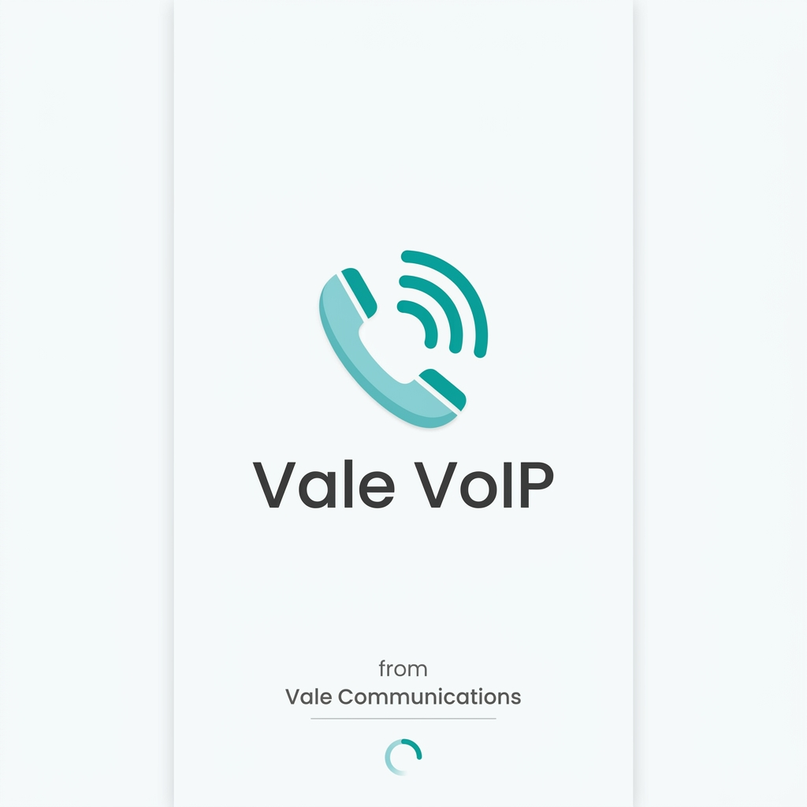
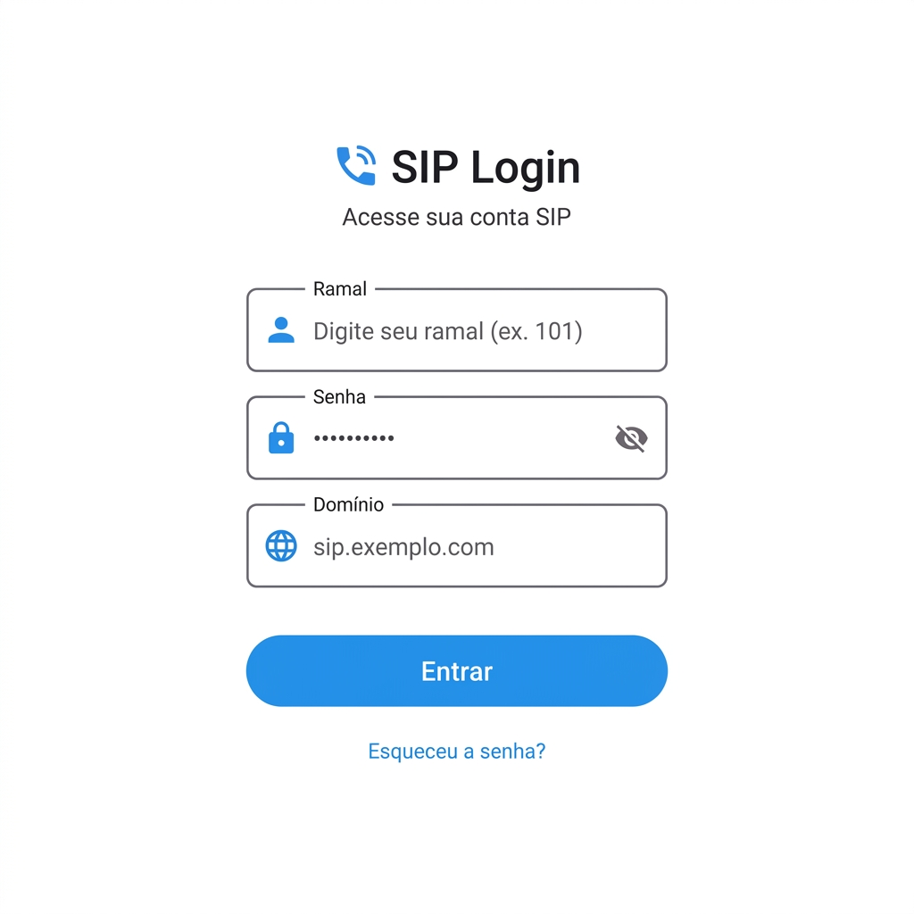

# Vale VoIP 📞

Bem-vindo ao repositório do **Vale VoIP**, um aplicativo Android moderno focado em comunicação por voz (SIP/VoIP). Ele foi projetado para atuar como um ramal móvel inteligente, integrando-se de forma consistente com sua infraestrutura SIP (como Asterisk ou FreePBX). 

Este projeto foi desenvolvido como Trabalho de Conclusão de Curso (TCC), com o objetivo de demonstrar a aplicação de boas práticas em desenvolvimento Android nativo e arquitetura de software escalável.

## 🚀 Sobre o Projeto

O **Vale VoIP** apresenta uma interface elegante e amigável construída 100% com **Jetpack Compose** (padrão MVVM) e uma estrutura baseada em *Clean Architecture* com módulos independentes. O motor SIP utilizado é o **Linphone** (com arquitetura pronta para substituições futuras para PJSIP/PJSUA2), perfeitamente desacoplado da camada visual e de negócio, garantindo alta manutenibilidade e flexibilidade.

### 📋 Principais Funcionalidades

De acordo com o nosso [documento de especificações e requisitos](docs/requirements.md), o aplicativo dispõe de:

- **Autenticação SIP (RF01):** Registro simplificado da conta com Usuário/Ramal, Senha e Domínio.
- **Efetuar Chamadas (RF02):** Interface intuitiva de discador numérico para originar chamadas.
- **Receber Chamadas (RF03):** Notificação em tempo real suportada por um *Foreground Service* contínuo.
- **Controle de Áudio (RF04):** Opções durante a chamada para Mute/Unmute e acionamento de Viva-voz.
- **Controle de Conexão (RF05):** Permite aceitar, desligar chamadas em andamento ou rejeitar tentativas recebidas.
- **Histórico (RF06):** Visualização fácil do registro de atividades de chamadas (recebidas, efetuadas, perdidas).

## 🛠️ Tecnologias e Decisões Arquiteturais

A construção do software seguiu diretrizes rígidas de engenharia:
- **Linguagem & Assincronismo:** Kotlin utilizando Coroutines e Flows para manter a UI reativa e segura contra travamentos na *Main Thread* (*Main-safe*).
- **Interface Gráfica:** Jetpack Compose projetado num tema claro (Light Mode) focado em minimalismo corporativo.
- **Arquitetura (RNF01):** Clean Architecture respeitada através de isolamento do domínio. Camadas de infraestrutura dependem das de domínio, favorecendo Inversão de Controle e Injeção de Dependências.
- **Modularização (RNF01):** Múltiplos módulos (`core:domain`, `core:sip-network`, `feature:dialer`, `feature:call`) para baixo acoplamento.
- **Build System Moderno (RNF02):** Configuração com `libs.versions.toml` e *Convention Plugins* (`build-logic`).
- **Resiliência (RNF05):** Uso inteligente de *Foreground Service* para a manutenção contínua da conexão com o PBX.

## 🖼️ Telas do Aplicativo

Abaixo você confere o layout e conceito visual desenvolvido para o aplicativo.

### Splash Screen
> Abertura limpa e direta, reforçando a identidade moderna do VoIP.

### Tela de Login
> Credenciamento seguro do ramal SIP com campos acessíveis e interface polida.

### Discador (Dialer)
> Teclado numérico amplo e responsivo, pronto para uso intuitivo.

---
*Projeto desenvolvido seguindo princípios SOLID, Clean Code e padrões recomendados para a plataforma Android.*
